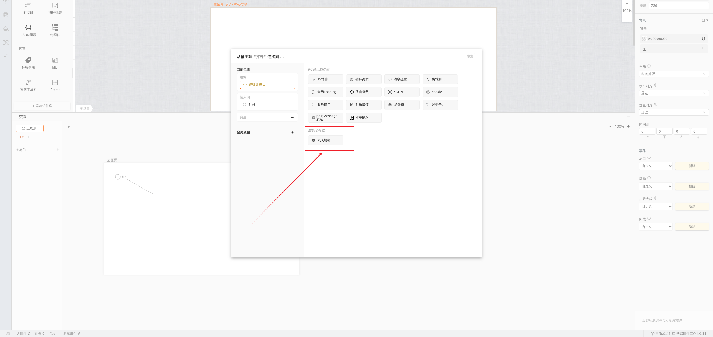
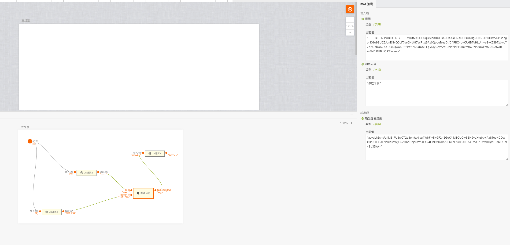

# RSA加密组件

> 基于jsencrypt的rsa加密，提供搭建过程中对加密需求的能力

## 使用

在逻辑卡片中**连线时**弹出的逻辑组件中选择**RSA加密组件**，传入密钥和需要加密内容（都是字符类型）即可

## 输入项

RSA加密组件有两个输入，都是字符类型，一个是密钥，另一个是需要加密的内容

## 输出项

RSA加密组件的输出项是加密后的结果，如果加密成功是字符类型，失败或者缺少参数、参数类型不正确将返回false
